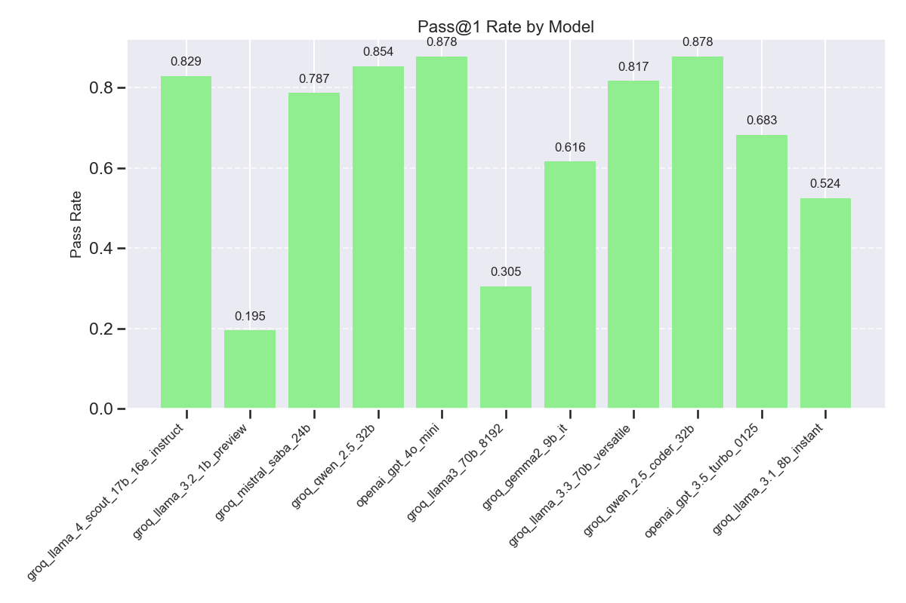

# LLM Evaluation Index
A Python tool to evaluate the performance of Large Language Models (LLMs) across various API providers and dimensions.

## Features
- Evaluate models on multiple dimensions:
    - **Average Response Time**: Time taken to generate complete responses.
    - **Pass@1 Rate**: Percentage of problems solved correctly on the first attempt.
    - **Time to First Token (TTFT)**: Time taken to start generating output.
    - **Regression Analysis**: Correlation between response time, TTFT, and token count.
- User-friendly Gradio interface for evaluation and visualization.
- Compatible with all OpenAI-like API platforms.

## Example Results





## Installation
### Prerequisites
- Python 3.8 or higher
- pip or conda package manager

### Steps

1. Clone the repository:
    ```bash
    git clone https://github.com/Haozhe-Li/llm_eval_index.git
    cd llm_eval_index
    ```

2. Set up a virtual environment (optional but recommended):
    ```bash
    # Using venv
    python -m venv venv
    source venv/bin/activate  # On Windows: venv\Scripts\activate
    
    # Or using conda
    conda create -n llm_eval python=3.10
    conda activate llm_eval
    ```

3. Install dependencies:
    ```bash
    pip install -r requirements.txt
    ```

4. Configure API keys:
    Create a `.env` file in the project root and add your API keys:
    ```env
    OPENAI_API_KEY=your_openai_api_key
    GROQ_API_KEY=your_groq_api_key
    # Add other provider API keys as needed
    ```

## Evaluation

Run the evaluation:
```bash
python3 app.py
```

Access the Gradio interface at `http://localhost:7680` for GUI-based evaluation.

## Visualization

Visualize the results:
```bash
python3 visualize.py
```

Access the Gradio interface at `http://localhost:7680` for GUI-based visualization.